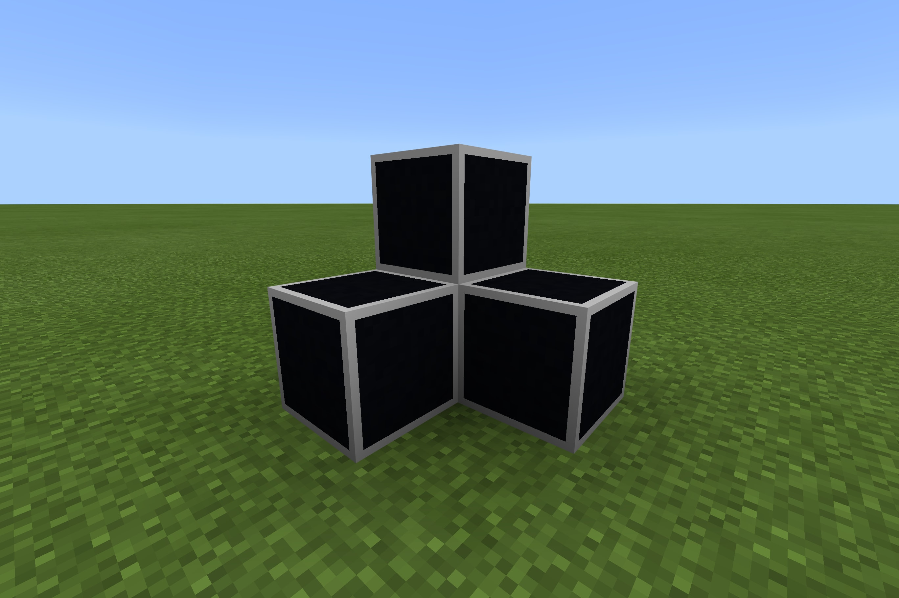

# BuildWithBlack

Ever been building with black concrete, and wished you could see the outlines of each block? Wish no longer! This resource pack adds a light grey outline to every black concrete block.

To use it, simply download and open the [`BuildWithBlack.mcpack`](https://raw.githubusercontent.com/TheDragonRing/buildwithblack/master/BuildWithBlack.mcpack) file.

_For Minecraft: Bedrock Edition (Windows 10, iOS, Android + more...)_

---

